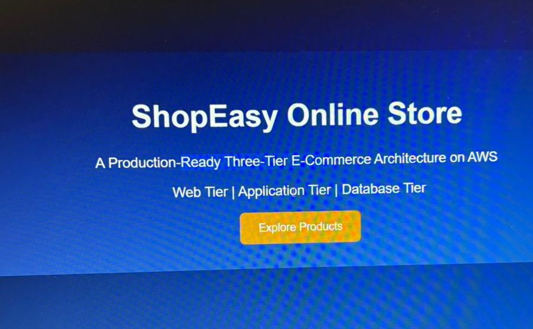
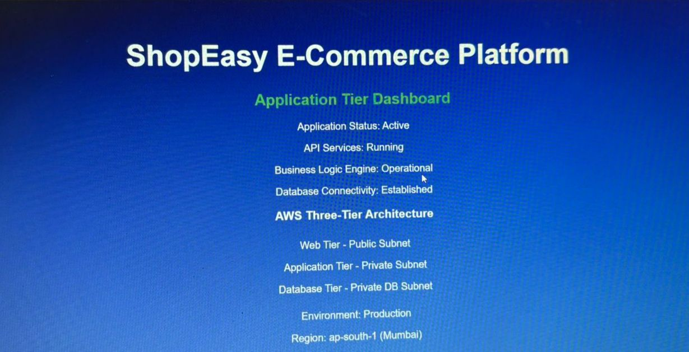
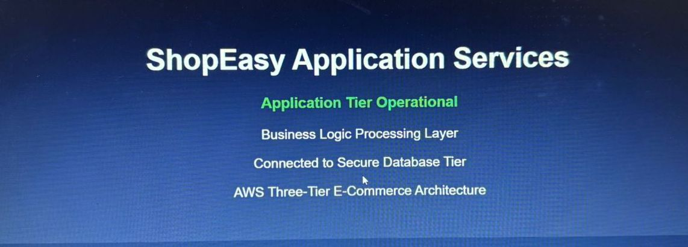
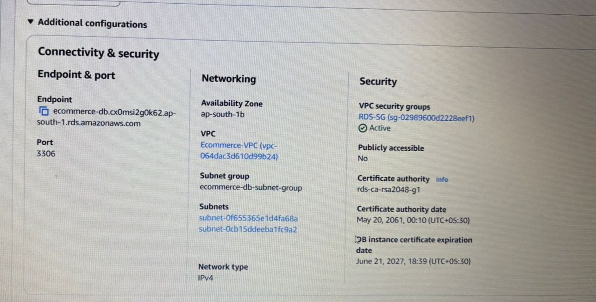
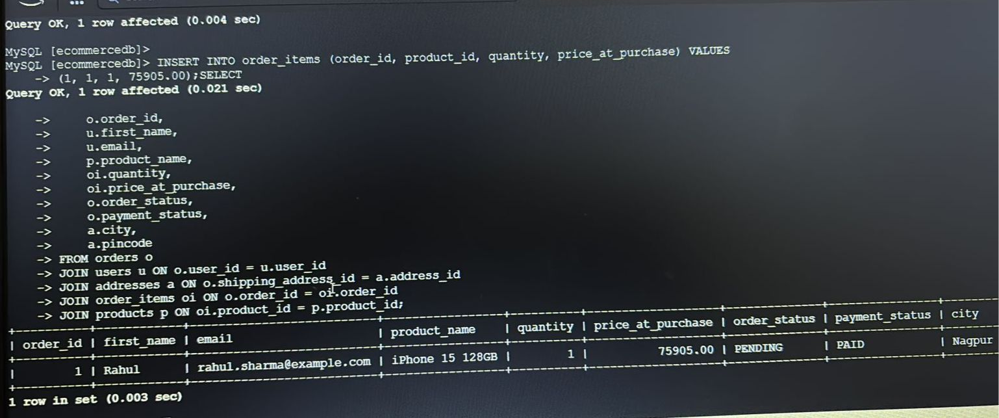
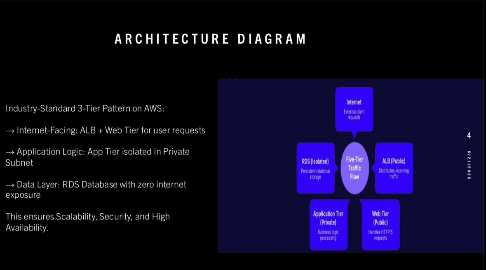

##AWS 3-Tier E-Commerce Architecture with High Availability & Security

 📌 Project Overview
This project demonstrates a production-ready, highly available 3-tier e-commerce architecture on AWS. It implements secure networking, load balancing, auto scaling, and database isolation using core AWS services.

The Application Load Balancer distributes traffic across EC2 instances in public subnets. The application connects to an RDS MySQL database deployed in private subnets with no public access. Auto Scaling ensures availability while NAT Gateway provides secure outbound internet for private instances.

### 🛠️ AWS Services Used
- **Compute**: Amazon EC2, Auto Scaling Group (ASG)
- **Networking**: VPC, Public & Private Subnets, Internet Gateway, NAT Gateway, Route Tables
- **Load Balancing**: Application Load Balancer (ALB), Target Groups
- **Database**: Amazon RDS for MySQL with Multi-AZ
- **Security**: Security Groups, IAM Roles, Private Subnets for DB layer
- **Web Server**: Apache HTTP Server

### 🔐 Key Security Features
1. **Database Isolation**: RDS instance has `Publicly Accessible: No`. Database is deployed in private subnets only.
2. **Least Privilege**: Security groups allow traffic only between tiers. Web → App → DB.
3. **No Direct DB Access**: Database cannot be accessed from the internet, only from the application tier.

### ✅ Project Implementation & Proof
1. **Architecture Diagram**: Complete 3-tier setup with public/private subnet separation.
2. **Security Verification**: Screenshot proving RDS is not publicly accessible.
3. **End-to-End Testing**: Order placed via ALB URL successfully saved in private RDS database.
### 📸 Live Project Screenshots - End-to-End Proof

#### 1. ShopEasy Storefront - Public ALB Access

**Architecture Proof:** Web Tier running on Application Load Balancer. Publicly accessible via ALB DNS. This is the only public entry point.

#### 2. Application Tier Dashboard - Private Subnet  

**Security Proof:** Application server running in **Private Subnet**. `Database Connectivity: Established` confirms secure connection to RDS. `Region: ap-south-1 (Mumbai)` visible.

#### 3. Application Services - Business Logic Layer

**3-Tier Proof:** `Connected to Secure Database Tier` message confirms App Tier successfully communicating with Database Tier through private network only.

#### 4. RDS Security Configuration - Database Tier

**Critical Security Proof:** Database instance shows `Publicly Accessible: No`. Confirms RDS is deployed in private subnet with no public IP, following AWS best practices.

#### 5. Live Order Verification - Data Flow Test

**End-to-End Proof:** Order placed from public website was successfully saved in the private RDS database, validating complete 3-tier data flow: Web Tier → App Tier → Database Tier.

#### 6. High-Level Architecture Diagram

**Design Proof:** Complete 3-tier setup showing VPC, Public/Private Subnets, ALB, EC2 instances, and RDS across 2 Availability Zones for high availability.

### 📄 Full Details
[**📥 Download Project PDF**](./sonal%20rasal-%20AWS%203-tier%20Ecommerce-project%20(3)/sonal%20rasal-%20AWS%203-tier%20Ecommerce-project%20(1).pdf)

### 👩‍💻 Author
**Sonal Subhash Rasal** | AWS Cloud Enthusiast
